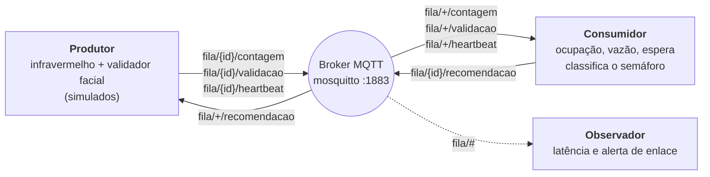

# Grupo Leite de Pedra: Caio Castro Miranda, João Pedro de Brito Tomé, João Victor Braga e Jaime da Cruz

# Marco 2 — balanceamento de filas de entrada

O sistema conta quem entra e quem sai de cada fila de entrada de um evento,
estima o tempo de espera e sinaliza num semáforo (verde, amarelo, vermelho)
qual fila procurar, para que um pico de chegada se distribua em vez de
empilhar numa fila só.

## Fluxo



1. O **produtor** publica a telemetria de cada fila no broker.
2. O **consumidor** assina a telemetria, calcula o estado de cada fila e publica a recomendação.
3. O **observador** assina `fila/#` e só acompanha: vê a telemetria e as recomendações passarem.
4. O produtor também assina a recomendação: quem chega e encontra o semáforo fechado entra na fila indicada. É isso que fecha o ciclo.

| Componente | Publica | Assina |
|---|---|---|
| `produtor/produtor.py` | `fila/{id}/contagem`, `fila/{id}/validacao`, `fila/{id}/heartbeat` | `fila/+/recomendacao` |
| `consumidor/consumidor.py` | `fila/{id}/recomendacao` | `fila/+/contagem`, `fila/+/validacao`, `fila/+/heartbeat` |
| `observador/observador.py` | — | `fila/#` |

`{id}` é `fila-a`, `fila-b`, … (2 a 4 filas, definidas no produtor).

## Payloads

Todos são JSON.

### Telemetria (produtor → consumidor e observador)

Os três tipos têm os mesmos campos base. A identidade de um evento é o par `(tipo, sequence)`;
`sequence` é um contador por tipo. `eventTimeMs` é o instante em que o evento aconteceu (epoch em ms).

**`fila/{id}/contagem`** — o infravermelho contou uma pessoa entrando na fila.

```json
{"filaId": "fila-a", "tipo": "contagem", "sequence": 41, "eventTimeMs": 1758200000000}
```

**`fila/{id}/validacao`** — o validador facial tentou liberar uma pessoa. Só `aprovado` tira alguém da fila (~15% são `reprovado`).

```json
{"filaId": "fila-a", "tipo": "validacao", "sequence": 37, "eventTimeMs": 1758200007000, "resultado": "aprovado"}
```

```json
{"filaId": "fila-a", "tipo": "validacao", "sequence": 38, "eventTimeMs": 1758200013000, "resultado": "reprovado"}
```

**`fila/{id}/heartbeat`** — a cada 2 s, por fila. Não entra na contagem; só prova que o enlace está vivo.

```json
{"filaId": "fila-a", "tipo": "heartbeat", "sequence": 120, "eventTimeMs": 1758200014000}
```

### Recomendação (consumidor → produtor e observador)

**`fila/{id}/recomendacao`** — publicada só quando o par (`semaforo`, `sentidoRecomendado`) muda.

```json
{
  "filaId": "fila-a",
  "semaforo": "bloqueada",
  "ocupacao": 5,
  "sentidoRecomendado": "fila-b",
  "motivo": "fila-a está VERMELHO (34s de espera, 5 na fila); fila-b está VERDE (7s de espera, 1 na fila)",
  "tempoEsperaEstimado": 34
}
```

| Campo | Valores |
|---|---|
| `semaforo` | `livre` (verde, espera ≤ 15 s), `atencao` (amarelo, 15–30 s), `bloqueada` (vermelho, > 30 s) |
| `ocupacao` | entradas contadas − saídas aprovadas |
| `sentidoRecomendado` | a própria fila (permanecer) ou a fila para onde desviar |
| `motivo` | texto explicando a decisão |
| `tempoEsperaEstimado` | segundos; `null` se indeterminado (vazão ainda não medida ou validador parado) |

## Como rodar

Preparação, uma vez (o serviço do mosquitto ocupa a porta 1883, então precisa ser mascarado):

```
sudo apt install mosquitto mosquitto-clients python3-paho-mqtt
sudo systemctl stop mosquitto
sudo systemctl mask mosquitto
```

Quatro terminais:

```
mosquitto -c mosquitto.conf                # terminal 1
python3 -u consumidor/consumidor.py        # terminal 2
python3 -u observador/observador.py        # terminal 3
python3 -u produtor/produtor.py            # terminal 4 (opcional: 2, 3 ou 4 filas)
```

Só o produtor recebe a quantidade de filas: o consumidor as descobre pelos tópicos que chegam.
