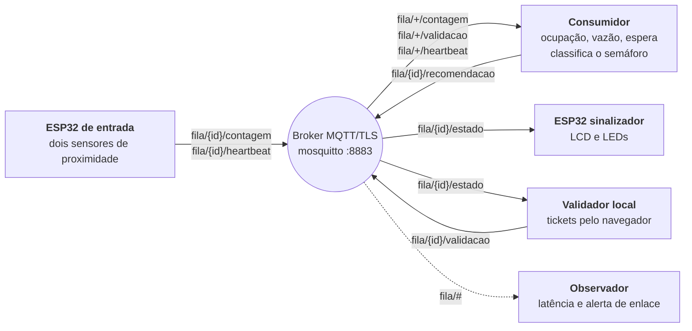

# Grupo Leite de Pedra: Caio Castro Miranda, João Pedro de Brito Tomé, João Victor Braga e Jaime da Cruz

# Marco 3 — balanceamento seguro de filas de entrada

O sistema conta quem entra e quem sai de cada fila de entrada de um evento,
estima o tempo de espera e sinaliza num semáforo (verde, amarelo, vermelho)
qual fila procurar, para que um pico de chegada se distribua em vez de
empilhar numa fila só.

## Fluxo


```mermaid
flowchart LR
    P["<b>ESP32 de entrada</b><br/>dois sensores de proximidade"]
    S["<b>ESP32 sinalizador</b><br/>LCD e LEDs"]
    V["<b>Validador local</b><br/>tickets pelo navegador"]
    B(("Broker MQTT/TLS<br/>mosquitto :8883"))
    C["<b>Consumidor</b><br/>ocupação, vazão, espera<br/>classifica o semáforo"]
    O["<b>Observador</b><br/>latência e alerta de enlace"]

    P -- "fila/{id}/contagem<br/>fila/{id}/heartbeat" --> B
    V -- "fila/{id}/validacao" --> B
    B -- "fila/+/contagem<br/>fila/+/validacao<br/>fila/+/heartbeat" --> C
    C -- "fila/{id}/recomendacao" --> B
    B -- "fila/{id}/estado" --> S
    B -- "fila/{id}/estado" --> V
    B -. "fila/#" .-> O
```

1. O **ESP32 de entrada** detecta chegadas pelos HC-SR04 e publica contagem e heartbeat.
2. A **página local** simula a validação do ticket e publica a saída aprovada.
3. O **consumidor** mantém o saldo em SQLite, mede a vazão e publica o estado da fila.
4. O **ESP32 sinalizador** recebe o estado e acende LEDs e LCD; o **observador** acompanha todos os eventos.

O Wokwi não executa dois microcontroladores no mesmo projeto. Por isso há
dois circuitos (`wokwi/diagram.json` e `wokwi/sinalizador/diagram.json`),
abertos em duas instâncias da simulação. Eles se comunicam pelo broker local,
não por fios entre as placas.

| Componente | Publica | Assina |
|---|---|---|
| `wokwi/src/main.cpp` (`produtor`) | `fila/{id}/contagem`, `fila/{id}/heartbeat` | — |
| `wokwi/src/sinalizador.cpp` (`sinalizador`) | — | `fila/+/estado` |
| `validacao/servidor.py` (`validador`) | `fila/{id}/validacao` | `fila/+/estado` |
| `consumidor/consumidor.py` | `fila/{id}/recomendacao`, `fila/{id}/estado` | `fila/+/contagem`, `fila/+/validacao`, `fila/+/heartbeat` |
| `observador/observador.py` | — | `fila/#` |

Na demonstração Wokwi, `{id}` é `fila-a` ou `fila-b`. O antigo
`produtor/produtor.py` permanece como simulador alternativo sem Wokwi.

## Payloads

Todos são JSON.

### Telemetria (produtor → consumidor e observador)

`eventTimeMs` é o instante em que o evento aconteceu (epoch em ms), obtido do
relógio do ESP32 sincronizado inicialmente por NTP. O ESP32
atribui `eventId` único às chegadas; o validador também atribui um `eventId`
à validação. O consumidor ignora eventos repetidos pelo MQTT.

**`fila/{id}/contagem`** — o sensor ultrassônico detectou uma pessoa entrando na fila.

```json
{"eventId": "esp32-abc-41", "filaId": "fila-a", "tipo": "contagem", "eventTimeMs": 1758200000000}
```

**`fila/{id}/validacao`** — o operador validou um ticket na página local.
Somente `aprovado` tira alguém da fila; o endpoint desta demonstração publica
apenas aprovações.

```json
{"eventId": "id-unico", "filaId": "fila-a", "tipo": "validacao", "eventTimeMs": 1758200007000, "resultado": "aprovado"}
```

```json
{"eventId": "outro-id", "filaId": "fila-a", "tipo": "validacao", "eventTimeMs": 1758200013000, "resultado": "reprovado"}
```

**`fila/{id}/heartbeat`** — a cada 2 s simulados, por fila. Não entra na
contagem; só prova que o enlace está vivo. O consumidor mede a atividade pelo
instante em que recebe o heartbeat em seu relógio monotônico, com tolerância
de 15 s reais. O `eventTimeMs` não determina essa atividade: no Wokwi, o
relógio simulado pode avançar mais devagar que o relógio do computador.

```json
{"filaId": "fila-a", "tipo": "heartbeat", "eventTimeMs": 1758200014000}
```

### Recomendação e estado (consumidor → sinalizador e observador)

**`fila/{id}/recomendacao`** — publicada só quando o par (`semaforo`, `sentidoRecomendado`) muda.

```json
{
  "filaId": "fila-a",
  "semaforo": "bloqueada",
  "ocupacao": 5,
  "sentidoRecomendado": "fila-b",
  "motivo": "fila-a está VERMELHO (34s de espera, 5 na fila); fila-b está VERDE (7s de espera, 1 na fila)",
  "tempoEsperaEstimado": 34
}
```

| Campo | Valores |
|---|---|
| `semaforo` | `livre` (verde, espera ≤ 15 s), `atencao` (amarelo, 15–30 s), `bloqueada` (vermelho, > 30 s) |
| `ocupacao` | entradas contadas − saídas aprovadas |
| `sentidoRecomendado` | a própria fila (permanecer) ou a fila para onde desviar |
| `motivo` | texto explicando a decisão |
| `tempoEsperaEstimado` | segundos; `null` se a espera ficar indeterminada (por exemplo, validador parado) |

**`fila/{id}/estado`** contém `filaId`, `semaforo`, `ocupacao`,
`sentidoRecomendado` e `tempoEsperaEstimado`. É publicado com QoS 1 e `retain`
para que o sinalizador recupere o estado ao reconectar. A ocupação é persistida em
`.local/filas.sqlite3`; o arquivo `eventos.json` é apenas um espelho temporário.
Antes de haver duas validações, a espera usa 7 s por pessoa; depois passa a
usar a vazão observada. Assim o semáforo já reage ao crescimento da fila.

## Como rodar

### Segurança

Cada componente possui uma identidade MQTT diferente. O broker autentica essas
identidades por senha e aplica o princípio do menor privilégio por meio de ACLs:

| Identidade | Permissões |
|---|---|
| `produtor` | publica chegadas/heartbeat; o simulador Python legado também lê recomendações |
| `sinalizador` | somente lê o estado das filas |
| `consumidor` | lê telemetria e publica recomendações |
| `observador` | somente lê `fila/#` |
| `validador` | publica validações e lê o estado das filas |

O listener sem criptografia foi removido. Toda comunicação usa MQTT sobre TLS na
porta 8883, e os clientes validam o certificado do broker usando a CA local.
Senhas, chaves privadas e certificados de desenvolvimento ficam em
`.local/mqtt`, diretório ignorado pelo Git.

### Preparação

Instale as dependências uma vez:

```
sudo apt install mosquitto mosquitto-clients openssl python3-paho-mqtt
```

Gere a CA, o certificado de `localhost`/`host.wokwi.internal` e as cinco
credenciais aleatórias, depois prepare um cabeçalho local para cada ESP32:

```
./scripts/configurar-seguranca.sh
python3 scripts/preparar-wokwi.py
```

O script se recusa a sobrescrever uma configuração existente. Os arquivos de
senha individuais são lidos diretamente pelos clientes e têm permissão `0600`.
Os clientes usam a API de callbacks da versão 2 do Paho MQTT.
Se você já tinha a configuração anterior, execute
`./scripts/configurar-seguranca.sh --adicionar-sinalizador` uma vez. Se ela
ainda não tinha o usuário `validador`, execute também
`./scripts/configurar-seguranca.sh --adicionar-validador`. Depois rode
`python3 scripts/preparar-wokwi.py` e reinicie o broker. Não é necessário
renovar o certificado para adicionar apenas esse usuário.

### Execução

Para a demonstração integrada, use quatro terminais na raiz do projeto:

```
mkdir -p .local/logs
./scripts/iniciar-broker.sh 2>&1 | tee .local/logs/broker.log                    # terminal 1
python3 -u consumidor/consumidor.py 2>&1 | tee .local/logs/consumidor.log        # terminal 2
python3 -u observador/observador.py 2>&1 | tee .local/logs/observador.log        # terminal 3
python3 -u validacao/servidor.py 2>&1 | tee .local/logs/validador.log            # terminal 4
```

Abra `http://localhost:8000` no navegador. Abaixo das filas, a página mostra
as últimas linhas de cada terminal (lidas de `.local/logs/`) e a serial de
cada ESP32: o Wokwi expõe a serial dos sensores na porta 4000 e a do
sinalizador na 4001 (`rfc2217ServerPort` nos `wokwi.toml`). Compile **ambos** os firmwares na
pasta `wokwi/` com `pio run` (ou PlatformIO: Build). Em uma janela do VS Code,
selecione `wokwi/wokwi.toml` em `F1 → Wokwi: Select Config File` e inicie o
simulador: essa janela contém apenas os sensores. Em outra janela/instância do
VS Code, selecione `wokwi/sinalizador/wokwi.toml` e inicie a segunda simulação,
com o LCD e os LEDs. A simulação em VS Code precisa do gateway local do Wokwi para alcançar o broker
em `host.wokwi.internal:8883` (consulte a disponibilidade dessa função na sua
licença). Cada firmware usa um cabeçalho local próprio, gerado em
`wokwi/include/` e ignorado pelo Git, com apenas a senha do seu papel MQTT.

No Wokwi, clique em cada HC-SR04 para alterar a distância. Faça o ciclo
**400 cm → 40 cm → 400 cm** para representar a passagem de uma pessoa pela
entrada; só a transição para perto conta. Repita na fila A até haver três
pessoas: com a estimativa inicial de 7 s por pessoa, ela fica amarela. Cinco
pessoas a deixam vermelha. Na página, valide um ticket da fila A para registrar
uma saída; a contagem cai uma unidade. O LCD e os LEDs da segunda simulação
seguem o estado enviado pelo consumidor. **Não execute `produtor/produtor.py` junto com o Wokwi**:
ele é um simulador alternativo e geraria eventos adicionais.

O SQLite em `.local/filas.sqlite3` preserva a ocupação ao reiniciar o
consumidor. Para iniciar outro evento real, arquive ou zere esse banco de forma
deliberada; o projeto não apaga pessoas da fila automaticamente.

Por padrão, o broker aceita apenas conexões da própria máquina. Para usar outro
host, configure `MQTT_HOST`, `MQTT_PORT`, `MQTT_CA`, `MQTT_USERNAME` e
`MQTT_PASSWORD` (ou `MQTT_PASSWORD_FILE`) no ambiente. Nesse caso, emita um
certificado que contenha o nome DNS/IP do servidor e altere o endereço do
`listener` em `mosquitto.conf`; não desative a validação TLS.

### Verificação da autorização

Depois de iniciar o broker, um observador autenticado consegue assinar os
tópicos:

```
mosquitto_sub -h localhost -p 8883 \
  --cafile .local/mqtt/ca.crt \
  -u observador -P "$(cat .local/mqtt/observador.password)" \
  -t 'fila/#' -v
```

Esse mesmo usuário não consegue publicar, e um cliente anônimo não consegue se
conectar. As negativas aparecem no log do broker. TLS protege os dados em
trânsito; os arquivos `eventos.json` não são criptografados em repouso.

Para ver um **firmware sem a senha** tentando entrar, compile o ambiente
`intruso` (`pio run` já o inclui) e inicie a simulação de
`wokwi/intruso/wokwi.toml`. Ele usa o mesmo circuito dos sensores e a CA
(que é pública), mas uma senha inventada para o usuário `produtor`. O serial
mostra `Falha MQTT: ... (retorno 5)` a cada 3 s, e o log do broker registra
`wokwi-intruso ... disconnected: not authorised`. Nenhuma contagem chega ao
consumidor.

Para testar também a restrição de leitura com o broker em execução:

```
python3 scripts/testar-acl.py
```

Se precisar renovar apenas a CA e o certificado do broker, preserve as senhas com
`./scripts/configurar-seguranca.sh --renovar-certificados` e reinicie o broker.

## Marcos anteriores

Os entregáveis dos marcos anteriores ficam preservados em pastas próprias:
[`Marco1/`](Marco1/) (protótipos individuais) e [`Marco2/`](Marco2/)
(integração produtor → MQTT → consumidor, com seu próprio README).
